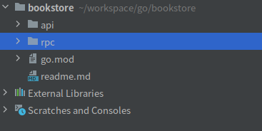
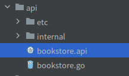
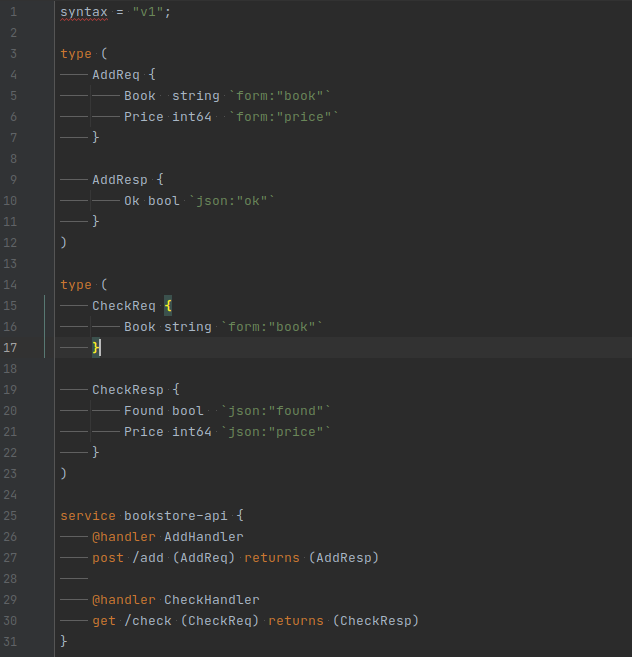
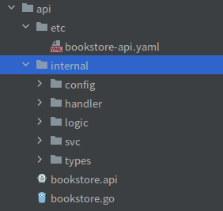
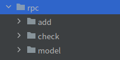
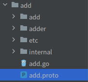
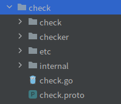
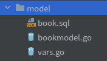

# go-zero第一个测试用例

[TOC]

### 一、项目说明

参考地址：https://www.yuque.com/tal-tech/go-zero/rm435c




```tex
api - gateway：rest -> rpc
rpc - rpc server：insert data to MySQL；query data from MySQL
```

#### 1.1、api



```tex
bookstore.api：
	api接口定义模版，通过命令“goctl api -o bookstore.api”生产，而后修改其定义内容；
	其他文件则是由命令“goctl api go -api bookstore.api -dir .”生产；

api
├── bookstore.api                  // api定义
├── bookstore.go                   // main入口定义
├── etc
│   └── bookstore-api.yaml         // 配置文件
└── internal
    ├── config
    │   └── config.go              // 定义配置
    ├── handler
    │   ├── addhandler.go          // 实现addHandler
    │   ├── checkhandler.go        // 实现checkHandler
    │   └── routes.go              // 定义路由处理
    ├── logic
    │   ├── addlogic.go            // 实现AddLogic
    │   └── checklogic.go          // 实现CheckLogic
    ├── svc
    │   └── servicecontext.go      // 定义ServiceContext
    └── types
        └── types.go               // 定义请求、返回结构体
```





#### 1.2、rpc



```tex
add - 保持数据到数据库
check - 从数据库查询数据
model - 数据库ddl及操作代码
```

##### 1.2.1、add



```tex
add.proto：
	通过命令“goctl rpc template -o add.proto”创建protobuf定义文件，修改文件内容；
	其他文件通过命令“goctl rpc proto -src add.proto -dir .”生产

rpc/add
├── add                   // pb.go
│   └── add.pb.go
├── add.go                // main函数入口
├── add.proto             // proto源文件
├── adder                 // rpc client call entry
│   └── adder.go
├── etc                   // yaml配置文件
│   └── add.yaml
└── internal              
    ├── config            // yaml配置文件对应的结构体定义
    │   └── config.go
    ├── logic             // 业务逻辑
    │   └── addlogic.go
    ├── server            // rpc server
    │   └── adderserver.go
    └── svc               // 资源依赖
        └── servicecontext.go
```

##### 1.2.2、check



```tex
同上

rpc/check
├── check                     // pb.go
│   └── check.pb.go
├── check.go                  // main入口
├── check.proto               // proto源文件
├── checker                   // rpc client call entry
│   └── checker.go
├── etc                       // yaml配置文件
│   └── check.yaml
└── internal
    ├── config                // yaml配置文件对应的结构体定义
    │   └── config.go
    ├── logic                 // 业务逻辑
    │   └── checklogic.go
    ├── server                // rpc server
    │   └── checkerserver.go
    └── svc                   // 资源依赖
        └── servicecontext.go
```

##### 1.2.3、model



```tex
手动创建book.sql文件，写入创建表语句，执行命令“goctl model mysql ddl -c -src book.sql -dir .”，获得其他2个go文件
```

